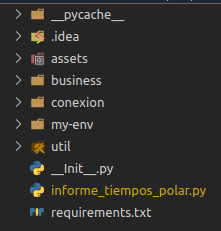
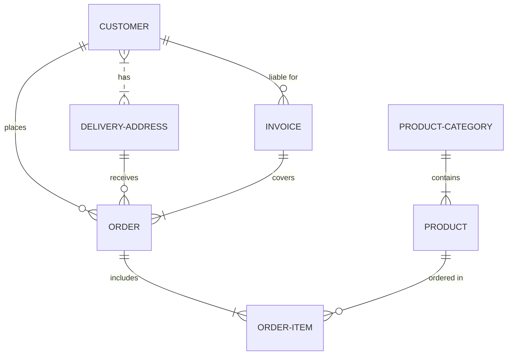
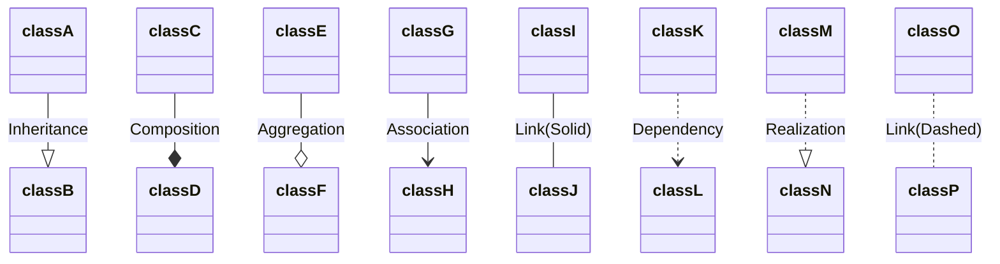

# Ejecución de proyectos Python en contenedores Docker


<div align="center">


</div>

## _Comenzando_ 🚀
El objetivo de este manual, es indicar los pasos para la correcta ejecución de proyectos hechos en el lenguaje Python utilizando contenedores Docker  estos proyectos pueden ser ejecutados desde crontabs en el  mismo servidor **172.24.1.123** el cual cuenta con SO **Centos7** o desde scripts desde alguna otra plataforma

#### Desarrollo del proyecto 📋

 1. ##### Creación entorno Virtual 

     Un virtualenv o entorno virtual de Python es un ambiente creado con el objetivo de aislar recursos como librerías y entornos de ejecución del sistema principal o de otros entornos virtuales. para crear un entorno Virtual ir a: [Entornos Visrtuales]("/projects_python/Creación_de_Entornos_Virtuales.md")

 2. ##### Estructura de directorios y archivos del proyecto Python
    Se recomienda dejar en la raíz del programa los siguientes archivos

    <div align="center">
    
    </div>

    - ***Ejecutable o iniciador del proyecto**** con el objetivo de que le sea más fácil la identificación de este archivo para el equipo de infraestructura
    - ***requierements.txt*** El cual está conformado por las librerías requeridas para la ejecución del proyecto, este archivo será el que buscara infraestructura para la instalación de las librerías.
        _Ejemplo de requirements .txt :_
        ```
        pandas == 1.3.0
        psycopg2-binary == 2.9.1
        openpyxl == 3.0.7
        Pillow == 8.2.0

        ```
        Utilizando EL manejador de paquetes conda:

        ```bash
        conda list -e > requirements.txt    
        ```
        
        Utilizando EL manejador de paquetes pip
        ```bash
        pip install -r requirements.txt
        ```   

## _Ejecutando las pruebas_ ⚙️

Las pruebas se deberá realizar desde consola y fuera del proyecto, esto garantiza que el proyecto se podrá ejecutar desde cualquier ambiente o servidor

***Nota:*** Si el proyecto usa rutas relativas, es necesario la implementación de: **os.path.dirname(__file__)** El cual es un método en Python que se usa para obtener el nombre del directorio de la ruta especificada.

_***Ejemplo de uso de rutas absolutas:***_
    El proyecto tiene una ruta donde guarda o consulta un archivo:
```python
    save_route = assets/informe_polar.xlsx'
```
Se debe cambiar a:
```python
    path_abs = os.path.dirname(__file__)
    save_route = path_abs + '/assets/informe_polar.xlsx'
```
El uso de este último método, garantiza que sin importar desde donde ejecute el proyecto, buscara o guardara los archivos en la ruta especificada.


## _Despliegue_ 📦
Una vez finalizado el proyecto y realizado las pruebas se realiza commit a al proyecto especificado
_este paso aun esta pendiente por generar repositorio git....._
La creación del contenedor y el crontab se debe realizar mediante un ticket al equipo de infraestructura si se desea indagar como se ejecuta el código en producción ver.....


## _Construido con_ 🛠️

* [Python](https://www.python.org/) - Lenguaje utilizado
* [pycharm](http://www.dropwizard.io/1.0.2/docs/) - El IDE usado

## _Autores_ ✒️

_Menciona a todos aquellos que ayudaron a levantar el proyecto desde sus inicios_

* **Erney Vargas** - *Trabajo Inicial* - [erney.vargas](http://git.mct.com.co/erney.vargas)
* **Erney Vargas** - *Documentación* - [erney.vargas](http://git.mct.com.co/erney.vargas)


---




