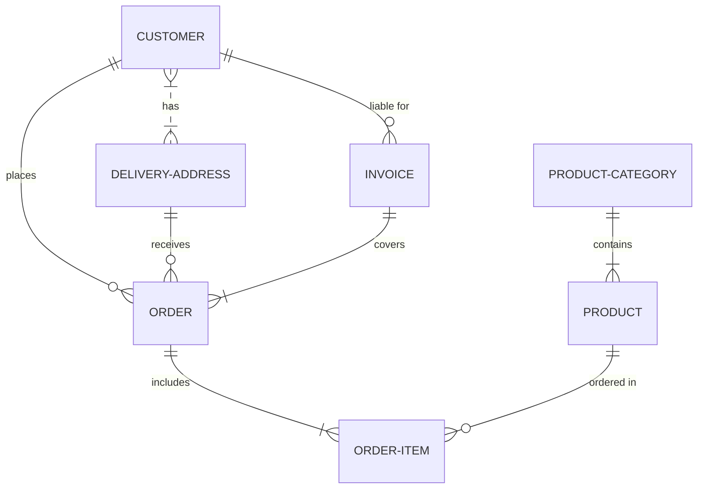
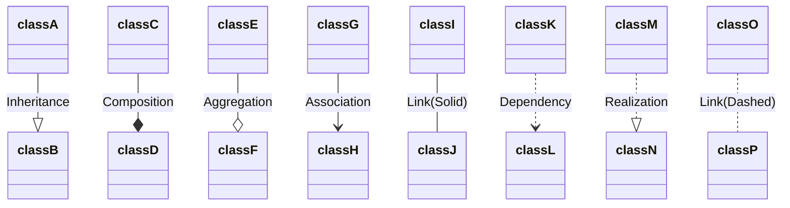

# Ejecución de Crontabs en Produccion


<div align="center">


</div>

## _Comenzando_ 🚀
El objetivo de este manual, es instruir como se ejecutan los crontabs cuando es usando el Crontab del anfitrión es decir el host que ejecuta su el motor Docker en el presente documento se usuara como ejemlo el servidor 172.24.1.123 el cual cuenta con SO Centos 7

**Que Es Docker?**

Docker es una plataforma de software que le permite crear, probar e implementar aplicaciones rápidamente. Docker empaqueta software en unidades estandarizadas llamadas contenedores que incluyen todo lo necesario para que el software se ejecute, incluidas bibliotecas, herramientas de sistema, código y tiempo de ejecución. Con Docker, puede implementar y ajustar la escala de aplicaciones rápidamente en cualquier entorno con la certeza de saber que su código se ejecutará.
1. ## _Ejecucion de imagen Docker_ :whale2:

    1. ##### Ejecucion de Imagen Docker 

        Los archivos arranca.sh se encargan de iniciar los contenedores

        La ubicacion de los archivos arranca.SH para el caso del servidor **172.24.1.123** se encuentran alojados en:
        ```python
        /home/docker/centos7/
        ```


        Un archivo arranca.sh esta conformado por:
        ```bash
       #!/bin/bash
        cd $(dirname "$0")
        local=$(pwd)
        echo "inicio"
        #--tmpfs /run --tmpfs /run/lock \
        docker run --privileged -e "container=docker" -d --name reportAPP \
        -p 172.24.1.123:8600:80 -p 172.24.1.123:8622:22 --dns 172.24.1.45 \
        --add-host git.mct.com.co:192.168.102.31 \
        --add-host galerand1.mct.com.co:192.168.102.135 \
        --add-host bd-test.mct.com.co:192.168.102.23 \
        --add-host bd.mct.com.co:192.168.102.24 \
        --add-host bd-select.mct.com.co:192.168.102.29 \
        --add-host notificaciones.mct.com.co:172.24.1.97 \
        -v centos_ssh-root:/root \
        -v $local/phpexcel1.7:/usr/local/phpexcel1.7 \
        -v $local/Rmail:/usr/local/Rmail \
        -v $local/projects_py:/opt/projects_py \
        -v centos7_ssh-usr-local-lib-python3.8:/usr/local/lib/python3.8 \
        -v /var/lib/docker/volumes/documentos_cli/local2/jpgraph:/usr/local/jpgraph \
        -v /var/lib/docker/volumes/documentos_cli/local2/toxtylab:/usr/local/toxtylab \
        -v /var/lib/docker/volumes/documentos_cli/local2/jasperreports-1.3.0:/usr/local/jasperreports-1.3.0 \
        -v /sys/fs/cgroup:/sys/fs/cgroup:ro \
        --env PATH=/usr/local/pgsql/bin:/usr/local/sbin:/usr/local/bin:/usr/sbin:/usr/bin:/sbin:/bin:/usr/local/php/bin:/usr/lib/x86_64-linux-gnu/ \
        -it centos_projects
        docker exec --privileged -it reportAPP postmap /etc/postfix/sasl_passwd
        sleep 3
        docker exec --privileged -it reportAPP systemctl stop sendmail
        docker exec --privileged -it reportAPP systemctl start postfix
        ```
        Este archivo de ejecucion se puede dividir en 4 niveles:

        1. ##### Docker Run
            El comando docker run crea y arranca un contenedor con los argumentos especifiacdos:.

            ```bash
            docker run --privileged -e "container=docker" -d --name reportAPP 
            
            ```

        2. ##### Nivel de redes
        
        ```bash
        -p 172.24.1.123:8600:80 -p 172.24.1.123:8622:22 --dns 172.24.1.45 
        
        ```


        <br><br><br><br><br><br><br><br><br><br><br>

    2. ##### Estructura de directorios y archivos del proyecto Python
        Se recomienda dejar en la raíz del programa los siguientes archivos

        <div align="center">
        
        </div>

        1. ***Ejecutable o iniciador del proyecto**** con el objetivo de que le sea más fácil la identificación de este archivo para el equipo de infraestructura
        <br><br>
        1. ***requierements.txt*** El cual está conformado por las librerías requeridas para la ejecución del proyecto, este archivo será el que buscara infraestructura para la instalación de las librerías.
            _Ejemplo de requierements .txt :_
            ```
            pandas == 1.3.0
            psycopg2-binary == 2.9.1
            openpyxl == 3.0.7
            Pillow == 8.2.0
            ```

## _Ejecutando las pruebas_ ⚙️

Las pruebas se deberá realizar desde consola y fuera del proyecto, esto garantiza que el proyecto se podrá ejecutar desde cualquier ambiente o servidor

***Nota:*** Si el proyecto usa rutas relativas, es necesario la implementación de: **os.path.dirname(__file__)** El cual es un método en Python que se usa para obtener el nombre del directorio de la ruta especificada.
<br><br>

_***Ejemplo de uso de rutas absolutas:***_
    El proyecto tiene una ruta donde guarda o consulta un archivo:
```python
    save_route = assets/informe_polar.xlsx'
```
Se debe cambiar a:
```python
    path_abs = os.path.dirname(__file__)
    save_route = path_abs + '/assets/informe_polar.xlsx'
```
El uso de este último método, garantiza que sin importar desde donde ejecute el proyecto, buscara o guardara los archivos en la ruta especificada.


## _Despliegue_ 📦
Una vez finalizado el proyecto y realizado las pruebas se realiza commit a al proyecto especificado
_este paso aun esta pendiente por generar repositorio git....._
La creación del contenedor y el crontab se debe realizar mediante un ticket al equipo de infraestructura si se desea indagar como se ejecuta el código en producción ver.....


## _Construido con_ 🛠️

* [Python](https://www.python.org/) - Lenguaje utilizado
* [pycharm](http://www.dropwizard.io/1.0.2/docs/) - El IDE usado

## _Autores_ ✒️

_Menciona a todos aquellos que ayudaron a levantar el proyecto desde sus inicios_

* **Erney Vargas** - *Trabajo Inicial* - [erney.vargas](http://git.mct.com.co/erney.vargas)
* **Erney Vargas** - *Documentación* - [erney.vargas](http://git.mct.com.co/erney.vargas)


---




